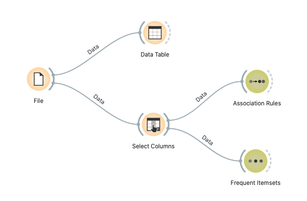
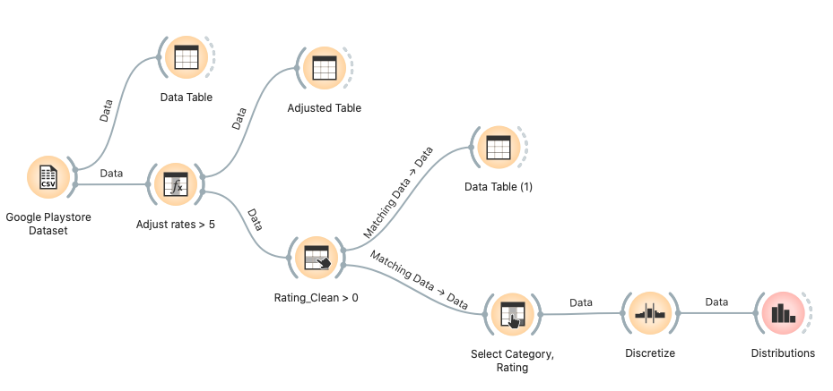
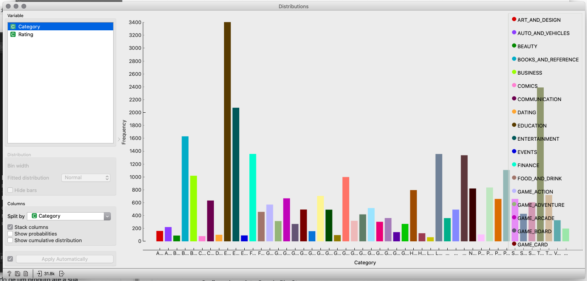
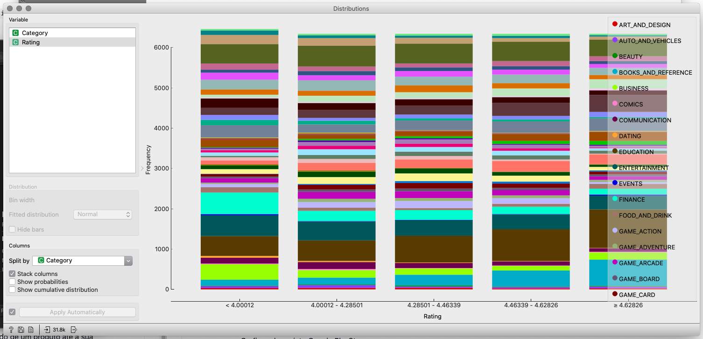
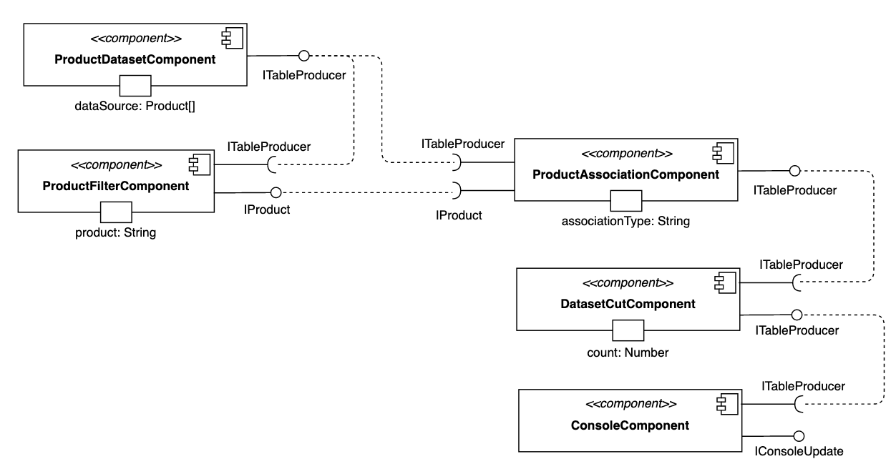
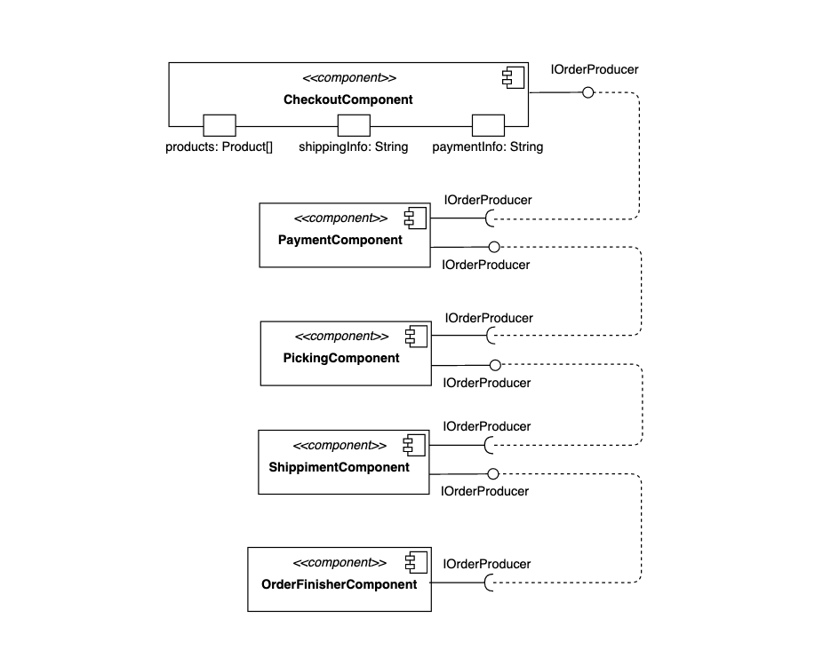
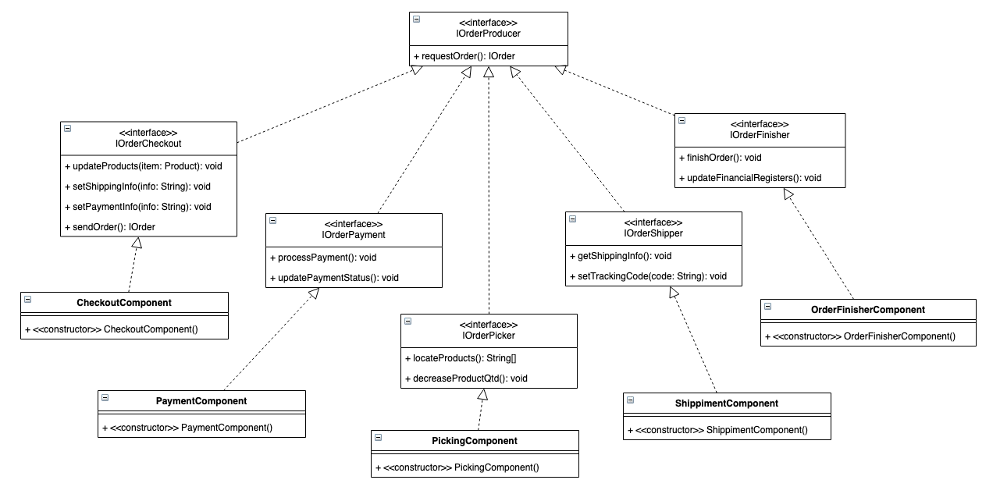

# Lab01 - Data Flow, Componentes e Regras de Associação

---

## Projeto Orange / Regras de Associação para Foodmart

Acesse o diretório [orange/foodmart em santanche/component2learn](https://github.com/santanche/component2learn/tree/master/labs/01-data-flow/orange/foodmart), que relaciona compras realizadas por clientes sobre produtos, e descubra regras de associação entre produtos. Como estes dados poderiam ser explorados para recomendar produtos para clientes?

### Imagem do Projeto

_Data flow_  

### Arquivos do Projeto

- [orange/foodmart](orange/foodmart)

---

## Projeto Orange / Análise de Dados do Google PlayStore

Acesse o diretório [orange/google-playstore em santanche/component2learn](https://github.com/santanche/component2learn/tree/master/labs/01-data-flow/orange/google-playstore) e elabore algum projeto que apresente algum gráfico que permita uma análise interessante dos dados.

### Imagem do Projeto

_Data flow_  

### Arquivo do Projeto

- [orange/google](orange/google)

### Gráfico(s) de Análise

_Distribuição por categoria_  

  

_Distribuição por nota_  

---

## Projeto de Composição de Componentes para Recomendação

Elabore um diagrama compondo componentes que seja capaz de executar o seguinte cenário:

1. O cliente escolhe um produto para compra.
2. O sistema encontra os produtos mais prováveis para recomendar, baseado em regras de associação.
3. O sistema recomenda (ranqueados) três outros produtos para o cliente.

Nesta tarefa, basta o diagrama de componentes, não é necessário detalhar as interfaces.

### Diagrama de Componentes

---

## Projeto de Composição de Componentes para Pedido

Elabore um diagrama de composição de componentes que execute o fluxo de execução que vai desde o pedido de um produto até a sua entrega para o cliente.

Nesta tarefa, você deve detalhar as interfaces em um diagrama UML a parte.

### Diagrama de Componentes

### Diagrama de Interfaces

